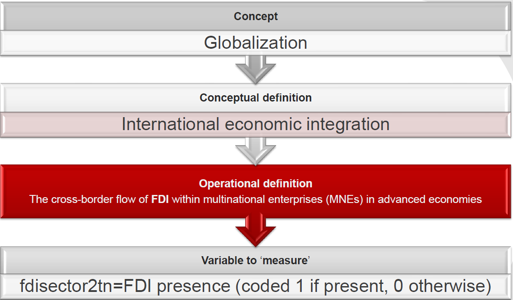

---
title       : Statistics Lab by Mujahed
author      : Md Mujahedul Islam
framework   : revealjs        # {io2012, revealjs, jshtml5slides, shower, dzslides, ...}
revealjs    :
 theme: solarized
 transition: concave
 center: "true"
highlighter : highlight.js  # {highlight.js, prettify, highlight}
<!-- hitheme     : zenburn      # -->
widgets     : []            # {mathjax, quiz, bootstrap}
bootstrap   :
 theme: amelia
mode        : selfcontained # {standalone, draft}
knit        : slidify::knit2slides
navbar:
 title: Statistics Lab by Mujahed
 items:
  #- {iten: Home, href: index}
  #- {item: "CPC Analytics", href: 'http://www.cpc-analytics.com/'}
--- ds:noborder

<!--Less number of # means bigger text-->
<!--To make an enter, use   command-->

## Measurements
##### Systematic and Random Erros | Nominal, Ordinal and Interval Levels Data
  
#### Statistics: Lab 1
 
 
<small> Conducted by
 
[Md Mujahedul Islam](https://de.linkedin.com/in/md-mujahedul-islam-4796583b) </small>

--- #rbi0

## Let's start!

<small> In the next slides, please press the **down** key to continue to a description of the topic. Press the <b>ESC</b> key to view a screenshot of the entire presentation </small>

--- &vertical ds:noborder

### Housekeeping 

***

<!--One ordered (<ol>) and one unordered (<ul>) HTML list:-->

<table cellpadding="0" cellspacing="5" border="0">

	<td><small><b> Information: </b></small></td>
	<td>  </td>
	<td> <small> Some administrative and important information:
    <ul style="list-style-type:square">
    
    </li>
     
    <li style="text-align:justify">
      Attendance is mandatory (there is an attendance list)
     
     
    </li>
     
    <li style="text-align:justify">
      One 'free miss' (use it wisely)
      
    </li>
     
    <li style="text-align:justify">
      Switch to a different lab rather than missing your lab (inform both me and other TA)
        
     </li>
      
    <li style="text-align:justify">
      Permanent switches only with 'partner' who takes your spot in this lab)
      
     
     </li>
      
    <li style="text-align:justify">
      Participation in the lab is graded and contributes 10% to your overall grade
      
     
      </li>
       
    <li style="text-align:justify">
      Permanent switches only with 'partner' who takes your spot in this lab)
       
      
       </li>
        
    <li style="text-align:justify">
       Examps (40%), Final Data Analysis (20%), Assignments (30%) and Labs (10%)

      
  </ul>
</small></td>
</tr>
</table>

--- &vertical

### Measurement: From "Concept" to "Operationalization" to "Variable Selection" (Example: Globalization)

***

***

<medium style="text-align:justify">Let's now check whether the above conceptual definition of globalization given by Scheve, K., et.al (2014) has communicated three features called:</medium>

 

<table cellpadding="0" cellspacing="0" border="0">
<tr>
	<td> <small><b> Variation: </b></small> </td>
	<td>  </td>
	<td>  <small style="text-align:justify"> The cross-border flow of FDI (FDI flows clearly vary)  </small> </td>
</tr>
<tr>
	<td>
		 
	</td>
</tr>
<tr>
	<td><small><b> Subject: </b></small></td>
	<td>  </td>
	<td> <small style="text-align:justify"> FDI flow within MNEs in advanced economices (it clearly says where the concept applies) </small></td>
</tr>
<tr>
	<td>
		 
	</td>
</tr>
<tr>
	<td><small><b> Measurement: </b></small></td>
	<td>  </td>
	<td> <small style="text-align:justify"> Whether there were FDI flows or not (it suggests how they are going to measure)</small></td>
</tr>
</table>

***

<medium style="text-align:justify"><b> Measurements errors </b></medium>

<small style="text-align:justify">

1. Systematic Error (Validity)
  - Face validity
  - Construct validiy
2. Random Error (Reliability)

</small>

<medium><b> Levels of measurements </b></medium>

<small style="text-align:justify"> 
  1. Nominal (Simply categorical data with no <b>ranking or ordering </b>)

  2. Ordinal (Simply categorical data with <b>ranking or ordering </b>)
  
  3. Interval (A measurement where the difference between two values is significant) 

</small>

***

#### Revision: Let's test ourselves!

**Discuss with a partner :-)**

<small style="text-align:justify">

1. What is *validity*?

2. Discuss the following measures in terms of *validity* and *reliability*.
    - GDP as a measure of quality of life in a country
    - Total tax revenue relative to GDP as measure of tax intake of countries
    
    
3. Propose a measurement for a person's political knowledge (think of a telephone survey).

4. Identify the level of measurement of the following variables:
    - GDP
    - Trade/GDP
    - Political system
    - Freedom House scores
    - Political Parties
    
</small>  

--- &vertical

### Using Stata: Let's have a fun-exercise

<small style="text-align:justify">

1. You should have a questionnaire in your front (You can also download the file called *fun_exercise_1_levelofmeasurement* from Moodle.

2. Please answer it and fill the data in Excel (You will find the Excel format in moodle named *fun_exercise_1_data_excel format*).

3. Now send data that you just filled in Excel to my email: mujahed.asia@gmail.com

4. Now download data named **ourdata.dta** in stata format (.dta) from moodle which I have just converted from Excel to stata format.

</small> 

--- &vertical

### Familiarizing yourself with the data

<small style="text-align:justify">

Now please open **ourdata.dta** and familiarise ourselves with the data by trying to answer the following questions:

1. How many observations does the dataset contain? **hint:** *count*

2. How many variables does the dataset contain? **hint:** *look above at the right-hand side of your opened STATA*

3. How can you *browse* data so that you can see what is in it? **hint:** *browse*

</small>

--- &vertical

### Inspecting some variables

<small style="text-align:justify">

1. What do the variables **sex** and **continent** measure? **hint:** *codebook*

2. What do the variables **satis_study** and **feelings** measure? **hint:** *codebook*

3. What do the variables **age** and **height** measure? **hint:** *codebook/summerize/sum*

4. What is the average **age** and **height** of your colleagues in this lab? **hint:** *summerise/sum*

</small>

--- &vertical

### See you next week :-)

 
 

